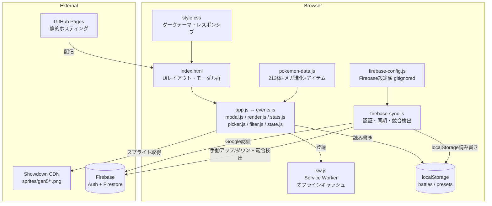
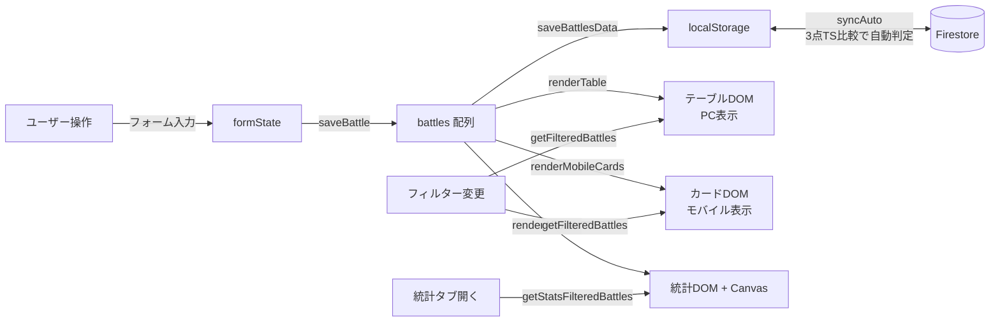
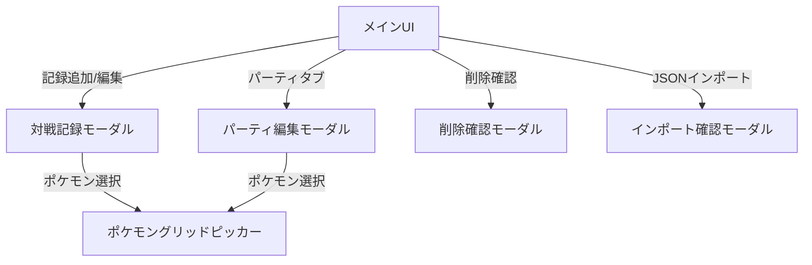
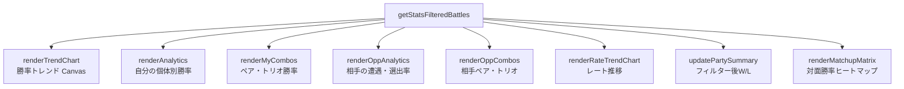
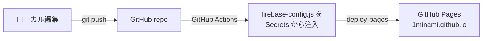

# pokemon-battle-log コード解説

> 最終更新: 2026-04-17

---

## 1. アナロジー: 「トレーナーの手帳 + 分析官 + クラウドロッカー」

このアプリは、**ポケモントレーナーの対戦記録手帳**のデジタル版。

日常生活で例えると、**野球のスコアブック + 打率計算係 + クラウドバックアップ付きロッカー**のようなもの。

- **スコアブック** = 対戦記録テーブル（PCではスプレッドシート、スマホではカード形式）
- **打率計算係** = 統計タブ（ポケモンごとの勝率、ペア/トリオの勝率、トレンドグラフを自動計算）
- **常連チームの名簿** = パーティプリセット（よく使う6体の組み合わせを名前付きで保存）
- **引き出し** = localStorage（ブラウザが手帳を預かってくれるので、サーバー不要）
- **クラウドロッカー** = Firebase Firestore（Googleアカウントでログインして、PCとスマホのデータを同期）

もう少し技術的に言うと、**スプレッドシートをReactなしのバニラJSで再実装したSPA**。フレームワーク依存ゼロで、`index.html`を開くだけで動く。GitHub Pages でホスティング、Firebase で認証+クラウド同期。

---

## 2. アーキテクチャ図

### 全体構造



### データフロー



### モーダル階層



### 統計計算の構造



### デプロイフロー



---

## 3. コードウォークスルー

### ファイル構成

ES Modules で責務別に分割（`<script type="module" src="app.js">` で読み込み）:

| ファイル | 行数 | 役割 |
|---------|------|------|
| `index.html` | ~450 | UIの骨格。6つのモーダル、3つのタブ、テーブル+モバイルカード、フィルター、FAB、同期UI |
| `app.js` | ~27 | エントリポイント。各モジュールを import して初期化 |
| `state.js` | ~130 | 状態変数 (battles, formState, sortDirection等), localStorage 読み書き, メガ正規化 |
| `utils.js` | ~50 | 純粋ヘルパー (generateId, formatDate, escapeHtml, showToast等) |
| `filter.js` | ~100 | フィルタリング、期間/ルール/タグ/結果フィルター、hash保存/復元 |
| `render.js` | ~200 | テーブル/カード描画、ポケモンアイコンHTML生成、統計サマリー更新 |
| `stats.js` | ~550 | 統計計算・チャート描画、対面勝率マトリクス |
| `picker.js` | ~350 | ポケモンピッカー（グリッドモーダル, スロット, 選出UI, タグ, アイテム） |
| `modal.js` | ~400 | モーダル管理, CRUD, CSV/JSONエクスポート/インポート, パーティタブ |
| `events.js` | ~300 | イベントリスナー登録, タブ切り替え, キーボードショートカット |
| `pokemon-data.js` | ~990 | 213体のポケモンデータ、メガ進化マッピング、ローマ字変換、レギュレーション別許可リスト |
| `style.css` | ~1850 | ダークテーマUI、モバイルレスポンシブ（カードレイアウト）、アニメーション |
| `firebase-sync.js` | ~200 | Firebase Auth（Google ログイン）+ Firestore 手動同期 + 競合検出 |
| `firebase-config.js` | ~11 | Firebase 設定値（gitignored, `export` 付き） |
| `firebase-config.example.js` | ~10 | 設定テンプレート |
| `sw.js` | ~85 | Service Worker（キャッシュ戦略: 静的→cache-first, Firebase→network-first） |
| `manifest.json` | ~20 | PWA マニフェスト（ホーム画面追加、スタンドアロン表示） |
| `icons/icon-192.png` | — | PWA アイコン 192x192 |
| `icons/icon-512.png` | — | PWA アイコン 512x512 |
| `.github/workflows/deploy.yml` | ~30 | GitHub Actions: Secrets 注入 → Pages デプロイ |

### pokemon-data.js の処理フロー

1. **`POKEMON_LIST`** — 213体 + メガ進化のオブジェクト配列 `{name, slug, dex}`
2. **`MEGA_MAP` / `MEGA_BASE`** — 基本形↔メガ進化の双方向マッピングを構築
3. **`POKEMON_DB`** — 重複排除 + 日本語あいうえお順ソート
4. **`POKEMON_BY_NAME`** — 名前→オブジェクトのO(1)ルックアップ辞書
5. **`toHiragana()` / `toRomaji()`** — カタカナ名を検索用にひらがな・ローマ字に変換
6. **各ポケモンに `searchHira` / `searchRomaji`** をプリコンピュート（検索時にリアルタイム変換しない）
7. **`getSpriteUrl()`** — Pokemon Showdown CDN からスプライトURLを生成
8. **`ITEM_LIST`** — 持ち物リスト（グループカテゴリ + 個別アイテム）
9. **`REGULATION_POKEMON` / `REGULATION_POKEMON_SET`** — レギュレーション別許可ポケモンをSetで高速判定

### モジュール構造

ES Modules で責務別に分割。依存関係:

```
app.js → events.js → modal.js, render.js, stats.js, picker.js, filter.js
                      modal.js → state.js, utils.js, render.js, picker.js
                      render.js → state.js, utils.js, filter.js, pokemon-data.js
                      stats.js → state.js, utils.js, filter.js, pokemon-data.js
                      picker.js → state.js, utils.js, pokemon-data.js
                      filter.js → state.js, pokemon-data.js
                      state.js → pokemon-data.js
```

循環依存を避けるためのパターン:
- **遅延バインディング**: `render.js` の `setRenderAllStats(fn)` で `stats.js` の関数を後から注入（`events.js` が接続）
- **関数注入**: `state.js` の `setShowToastFn(fn)` で `utils.js` の `showToast` を注入（`app.js` が接続）
- **firebase-sync.js は独立**: 別の `<script type="module">` として読み込み、メインアプリの障害から分離

#### 状態管理 (state.js)

```
battles[]          — 全対戦記録（localStorage から復元）
formState{}        — 現在のモーダルフォームの一時状態
  .myParty[]       — 自分のパーティ（最大6体）
  .mySelect[]      — 自分の選出（最大4体）
  .oppParty[]      — 相手のパーティ
  .oppSelect[]     — 相手の選出
  .tags[]          — タグ配列
  .myPartyItems{}  — ポケモン名→持ち物のマップ
  .oppPartyItems{} — 同上（相手側）
```

`formState` はモーダルが開いている間だけの一時バッファ。保存時に `battles[]` に書き出す。

ES Modules の live bindings を活用: `export let battles` + `export function setBattles(v)` のパターンで、モジュール間で状態を共有。

#### ポケモンピッカー

ポケモン選択UIは2段階のインタラクション:

1. **スロット表示** (`renderPickerSlots`) — 選択済みのポケモンをドラッグ＆ドロップで並べ替え可能なスロットで表示。各スロットに持ち物セレクトと削除ボタン付き
2. **グリッドモーダル** (`openPokemonGrid` → `renderPokemonGrid`) — ポケモンを検索して追加。レギュレーション絞り込み、使用頻度順ソート、4種の検索（カタカナ/ひらがな/ローマ字/英語slug）

**選出UI** (`renderSelectFromParty`) は、パーティから選出する3-4体をクリックでトグル。メガ進化があるポケモンには「M」バッジが表示され、クリックでフォーム切り替え。

#### テーブル + モバイルカード描画

`renderTable()` が呼ばれるたびに:
1. `getFilteredBattles()` でルール/結果/タグ/期間フィルター適用
2. 日付+IDでソート（同日はID順で安定ソート）
3. **PCテーブル**: `$tableBody.innerHTML` で13列のテーブルHTMLを全置換
4. **モバイルカード**: `renderMobileCards()` で `$mobileCards.innerHTML` にカードHTMLを生成
5. CSS `@media (max-width: 768px)` でテーブル非表示・カード表示を切替
6. ヘッダーの W/L/勝率を `updateStats()` で更新
7. `statsDirty = true` を立て、統計タブが表示中なら即再描画

モバイルカード (`renderBattleCardHtml`) は1枚のカードに「日付 + 結果 + レート + ルール + アクション」をヘッダーに、「自分/相手のパーティ+選出」を2カラムの本体に、タグとメモをフッターに配置。

#### 統計計算 (stats.js)

- **勝率トレンド** (`renderTrendChart`) — Canvas 2D APIで累積勝率を折れ線グラフ描画。グラデーション面積塗り、50%基準線、各ドットの勝敗色分け
- **レート推移** (`renderRateTrendChart`) — レート記録の折れ線グラフ。Y軸は記録範囲で自動スケール、ドットは勝敗で色分け
- **個体統計** (`renderAnalytics`) — 選出ポケモンごとのW/L棒グラフ
- **コンボ統計** (`renderMyComboGrid`, `renderOppComboGrid`) — `getCombinations()` で全C(n,k)を列挙し、先頭を固定したキーで集計（リード保存型）。カードクリックで該当試合（同じ順序でペア/トリオが揃った試合）を真下に展開（`renderComboDrill`）
- **相手統計** (`renderOppAnalytics`) — 遭遇数 vs 選出数で相手のパーティ傾向を可視化
- **対面勝率マトリクス** (`renderMatchupMatrix`) — 自分の選出ポケモン（行）× 相手パーティポケモン（列）のヒートマップ表。セルは勝率%で色分け（緑=高勝率, 赤=低勝率, 灰=中間）。最低5戦以上のペアのみ表示。水平スクロール対応

#### CRUD + エクスポート/インポート

- **保存**: `saveBattle()` — IDがあれば更新、なければ新規追加 → `saveBattlesData()` で localStorage書き込み
- **CSV**: UTF-8 BOM付き、`/` 区切りでパーティを結合
- **JSONエクスポート**: `{ battles, presets }` 形式で対戦記録+パーティを出力
- **JSONインポート**: 新形式 `{ battles, presets }` と旧形式（配列のみ）の両方に対応。上書き or 既存に追加を選択可能。パーティプリセットも復元される

#### Firebase 同期 (firebase-sync.js)

```
initFirebase()     — Firebase SDK を CDN から dynamic import、Auth/Firestore を初期化
firebaseLogin()    — signInWithPopup で Google ログイン
syncAuto()         — 3点TS比較で UP/DL/競合/最新 を自動分岐（メインの「☁ 同期」ボタン）
doUpload()         — localStorage の battles + presets を Firestore の users/{uid} に setDoc → lastSync/localUpdatedAt 更新
doDownload(data)   — getDoc 結果を localStorage に書き戻し → lastSync/localUpdatedAt を remote updatedAt に揃える → 再描画
forceUpload()      — 競合モーダルからの強制UP
forceDownload()    — 競合モーダルからの「先にダウンロード」
updateSyncUI()     — ログイン状態 + 同期状態のサブテキスト（相対時刻）を更新。30秒ティッカーで自動再計算
```

**自動判定（3点タイムスタンプ比較）**:

| キー | 役割 | 更新タイミング |
|---|---|---|
| `firebase-last-sync` | 最終同期時刻 | UP/DL成功時 |
| `pokemon-local-updated-at` | ローカル書込時刻 | `saveBattlesData`/`savePresetsData` 内の `markLocalUpdated()` |
| Firestore `updatedAt` | リモート書込時刻 | `doUpload` 時 |

`localChanged = localUpdatedAt > lastSync`、`remoteChanged = remoteUpdatedAt > lastSync`。両方 true で競合モーダル発火、片方のみ true で対応する向きへ転送、両方 false で「最新」トースト。DL時は `localUpdatedAt = remoteUpdatedAt` に揃え、次回判定でローカル変更扱いされないようにする（重要: ここを忘れるとDL直後に不要なUPループが発生）。

Firebase SDK はページロード時に自動初期化。`firebase-config.js` が未設定（空文字列）の場合は同期UI自体を非表示にする。`firebase-sync.js` は独立した `<script type="module">` として読み込まれ、設定ファイル不在時もメインアプリに影響しない。

#### イベントハンドラ

- テーブルクリックとモバイルカードクリックは両方ともイベント委任で `data-action` 属性により分岐（bookmark / edit / delete）
- `Ctrl+N` で新規追加、`Esc` で最前面モーダルを順に閉じる
- タブ切り替えは遅延描画（統計タブは `statsDirty` フラグで必要時のみ再計算）
- `window.resize` でトレンドチャートを再描画

---

## 4. 注意点・よくある誤解

### ポケモンピッカーの2層構造

フォームの「自分のパーティ」と「選出」は独立したUIだが、**データは連動している**。パーティを変更すると `updateDependentSelections()` が呼ばれ、選出から外れたポケモンが自動削除される。

### メガ進化の扱い

- `MEGA_MAP`: 基本形 → メガ形（配列。リザードンはX/Yの2つ）
- `MEGA_BASE`: メガ形 → 基本形（逆引き）
- **パーティ編成時のポケモングリッド（`renderPokemonGrid`）からはメガ形を除外**（選べるのは基本形のみ）
- 選出UI（`renderSelectFromParty`）では基本形にMバッジを出し、クリックでメガ形へトグル（選出配列にのみメガ名が入る）
- `loadBattles` / `loadPresets` / インポート時に `normalizeMegaIn*` で過去データのメガ名を基本形へ正規化
- 統計計算では `MEGA_BASE` で正規化してからカウント

### localStorage の容量制限

`saveBattlesData()` で `try/catch` しており、容量超過時はトーストでエラー通知。ただし、**容量超過の予防的チェックはない**。Firebase 同期があるので、万が一の場合はクラウドからダウンロードで復旧可能。

### 検索のマルチ言語対応

ポケモン検索は4系統を並列チェック:
1. `name` (カタカナ) — `includes`
2. `slug` (英語) — `includes`
3. `searchHira` (ひらがな変換済み) — `includes`
4. `searchRomaji` (ローマ字変換済み) — `includes`

ローマ字変換は `toRomaji()` でヘボン式。促音（ッ→子音二重化）、長音（ー→母音繰り返し）、拗音（キャ→kya）を正しく処理。

### レギュレーション対応

`REGULATION_POKEMON` に許可リストをSetで持ち、ルール選択時にポケモングリッドを自動フィルター。旧ルールで記録したデータは `ensureRuleOption()` で動的にドロップダウンに追加されるため、編集時にも失われない。

### モバイル表示の切替方式

CSS `@media (max-width: 768px)` で `.table-container { display: none }` / `.mobile-cards { display: flex !important }` としてテーブルとカードを排他的に表示。JS 側では `window.matchMedia('(max-width:768px)')` で判定し、表示中のビューのHTMLだけを生成する（不要な方の DOM 生成をスキップ）。画面サイズ変更でブレークポイントを跨いだ場合は自動で再描画。

### フィルター状態の URL 永続化

フィルター（ルール/結果/期間/タグ）の変更時に `location.hash` へ `URLSearchParams` 形式で保存。ページロード時に `restoreFiltersFromHash()` で復元するため、フィルター付きURLをブックマーク・共有できる。

### 対面勝率マトリクスの集計ロジック

統計タブの「対面勝率マトリクス」は、**「自分がXを選出した試合で、相手のパーティにYがいたときの勝率」**を表にしたもの。

- **行** = 自分の選出 (`mySelect`) の各ポケモン
- **列** = サブタブで切替（デフォルト `相手パーティ` = `oppParty` / `相手選出` = `oppSelect`）
- 引き分けは除外。メガ進化は `MEGA_BASE` で基本形に正規化してからカウント
- 各組み合わせが **5戦以上** ないとセルに表示されない (`MIN_BATTLES = 5`)
- 色分け: 勝率60%以上=緑（有利）、40〜59%=灰（五分）、40%未満=赤（不利）
- 並び順: 対戦数が多い順（よく使う/よく当たるポケモンが左上に来る）
- 統計タブのパーティフィルター・期間フィルターに連動
- **セルクリック** で該当試合（その X-Y ペアが揃った試合）を真下に展開。日付/結果/レート/自分選出/相手軸を1行カード形式で表示。再クリックまたは「閉じる」で閉じる

**注意: これは1対1の対面勝率ではない。** 「ガブリアスを選出して、相手パーティにサーフゴーがいた試合」では、ガブリアスとサーフゴーが直接対面したかどうかに関わらず、その試合全体の勝敗がカウントされる。選出判断の材料（「相手にYがいるときにXを出すとどうなるか」）として大まかな傾向を把握するのに使う。相手軸を「相手選出」に切り替えると、実際に出てきた相手ポケモンに限定した傾向が見られる。

### Firebase 同期の競合検出

「☁ 同期」1ボタン構成。タップすると `syncAuto()` が3点タイムスタンプ（`firebase-last-sync` / `pokemon-local-updated-at` / リモート `updatedAt`）を比較し、UP/DL/競合モーダル/「最新」トーストの4分岐を自動判定。両方変更時のみ競合モーダルを表示し「先にダウンロード」「強制アップロード」「キャンセル」を選択可能。ただし**レコード単位のマージロジックはない**（全データを一括で上書き/復元）。

---

## 5. 改善提案

### 品質

| # | 指摘 | 重要度 | 詳細 |
|---|------|--------|------|
| 1 | innerHTML によるXSSリスク | 🟡 Medium | `escapeHtml()` で対策されているが、`renderPokeIconsHtml` 等で `slug` が直接URLに埋め込まれている。slug はアプリ内定数のため実害はないが、JSONインポートで外部データを受け入れるため、インポート時にslugのバリデーションを入れるとより安全 |
| 2 | ~~インポートデータのバリデーション不足~~ | ✅ 解決済 | `validateBattle()` で必須フィールド (`date`, `result`) の存在・型チェックを実装。不正レコードはスキップされ、スキップ数がトースト通知される |
| 3 | `formState` がグローバルミュータブル | 🟢 Low | モーダルが1つしか同時に開かないため現状は問題ないが、パーティ編集モーダルと対戦記録モーダルが `formState.myParty` を共有しているため、両方が開いた状態でのエッジケースに注意 |
| 4 | ~~Firebase の Firestore セキュリティルール~~ | ✅ 解決済 | `users/{uid}` への read/write を `request.auth.uid == userId` で制限するルールを設定済み |

### パフォーマンス

| # | 指摘 | 重要度 | 詳細 |
|---|------|--------|------|
| 1 | ~~テーブル+カード同時生成~~ | ✅ 解決済 | `window.matchMedia('(max-width:768px)')` で判定し、表示中のビューのHTMLだけを生成するよう最適化済み。ブレークポイント跨ぎ時は自動再描画 |
| 2 | テーブル全置換 `innerHTML` | 🟡 Medium | 毎回のフィルター変更・ソートでDOM全体を再構築。100件程度なら問題ないが、500件超で描画が重くなる可能性。仮想スクロールまたは差分更新で改善可能 |
| 3 | `getPokemonUsageCounts()` が毎回全走査 | 🟢 Low | ポケモングリッドを開くたびに全battles をスキャンして使用回数を計算。キャッシュすれば高速化できる |

### 可読性

| # | 指摘 | 重要度 | 詳細 |
|---|------|--------|------|
| 1 | ~~app.js が2100行の単一ファイル~~ | ✅ 解決済 | ES Modules で10ファイルに責務別分割済み（state / utils / filter / render / stats / picker / modal / events / app） |
| 2 | マジックナンバー `4` (選出上限) | 🟢 Low | `data-max="4"` とハードコードされている箇所が複数。定数化で意図を明確にできる |
| 3 | ~~firebase-sync.js の `window._fb` パターン~~ | ✅ 解決済 | ES Modules 化に伴い、モジュールスコープの `fbModules` 変数に変更。グローバル汚染を解消 |

---

## 6. ロードマップ

### Phase 1（すぐやる）— ✅ 完了

| # | やったこと | 結果 | 工数 |
|---|-----------|------|------|
| 1 | Firestore セキュリティルールを本番設定 | `request.auth.uid == userId` で認証ユーザー自身に限定 | S |
| 2 | JSONインポートのフィールドバリデーション | `validateBattle()` で必須フィールド+型チェック。不正レコードはスキップ+通知 | S |
| 3 | `renderTable()` でメディアクエリ判定して片方だけ生成 | `matchMedia` で分岐、不要なDOM生成をスキップ。ブレークポイント跨ぎで自動再描画 | S |
| 4 | フィルター状態のURL反映 | `location.hash` に `URLSearchParams` 形式で保存・復元。ブックマーク可能 | S |

### Phase 2（中工数で高価値）— ✅ 完了

| # | やったこと | 結果 | 工数 |
|---|-----------|------|------|
| 1 | app.js のES Modules分割 | 10ファイルに責務別分割。循環依存を遅延バインディングで解決 | M |
| 2 | 同期の競合検出 + 1ボタン自動判定化 | 3点TS（lastSync / localUpdatedAt / remote updatedAt）比較で UP/DL/競合/最新 を自動分岐。UP/DLボタン2個 → 「☁ 同期」1個＋相対時刻サブテキストに統合 | M |
| 3 | 対面勝率マトリクス（ヒートマップ） | 自分の選出×相手パーティの勝率表。色分け（緑/灰/赤）、最低5戦以上のペアのみ表示 | M |
| 4 | PWA 化（Service Worker + manifest） | sw.js（cache-first + network-first）、manifest.json、アイコン。ホーム画面追加・オフライン対応 | M |

### Phase 3（将来）— 大きな設計変更

| # | やること | 理由（期待効果） | 工数 |
|---|---------|-----------------|------|
| 1 | IndexedDB 移行 | localStorage の5MB制限を回避。大量データに対応 | L |
| 2 | リアルタイム自動同期 | Firestore の `onSnapshot` で変更を即時反映。手動ボタン不要に | L |
| 3 | 対戦動画リンク + タイムスタンプ付きメモ | 動画レビューとの連携。対戦の特定ターンにメモを紐付け | L |
| 4 | 複数ユーザー対戦データ共有 | フレンド間でメタゲーム分析を共有。Firestoreのサブコレクションで実装 | L |
