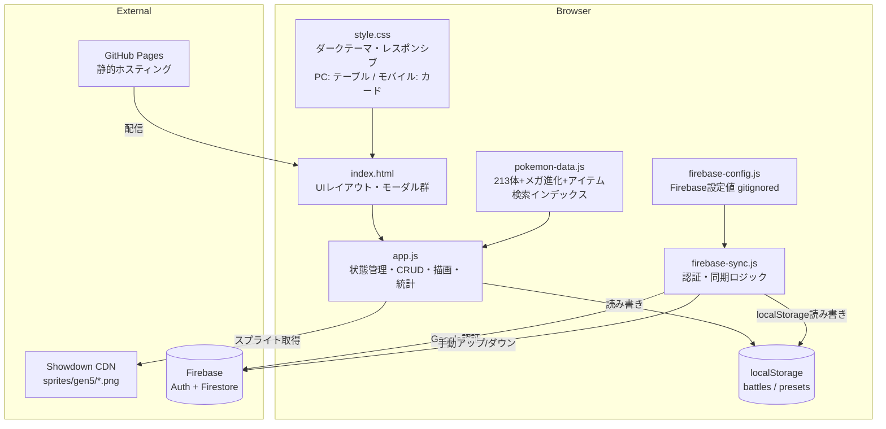
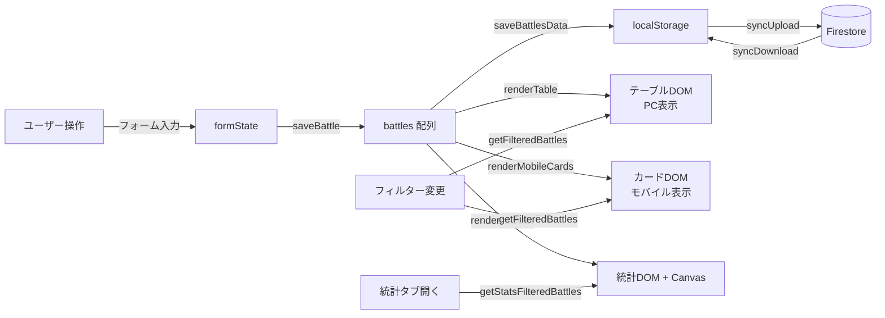
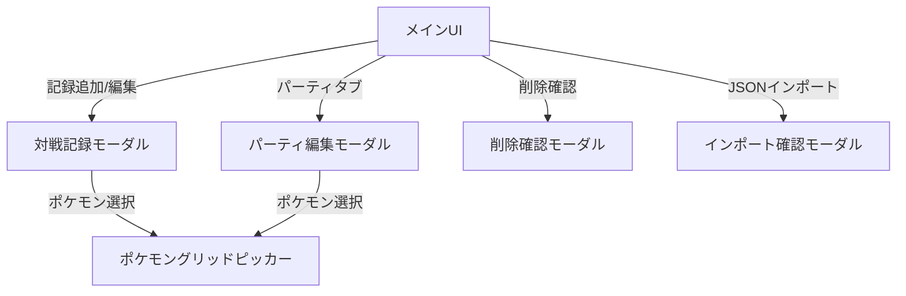
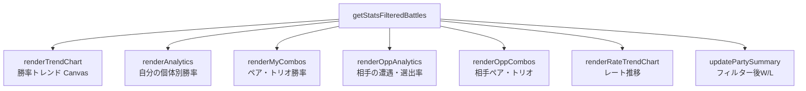
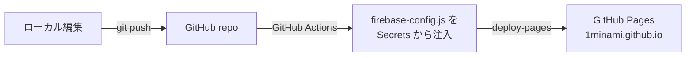

# pokemon-battle-log コード解説

> 最終更新: 2026-04-17

---

## 1. アナロジー: 「トレーナーの手帳 + 分析官 + クラウドロッカー」

このアプリは、**ポケモントレーナーの対戦記録手帳**のデジタル版。

日常生活で例えると、**野球のスコアブック + 打率計算係 + クラウドバックアップ付きロッカー**のようなもの。

- **スコアブック** = 対戦記録テーブル（PCではスプレッドシート、スマホではカード形式）
- **打率計算係** = 統計タブ（ポケモンごとの勝率、ペア/トリオの勝率、トレンドグラフを自動計算）
- **常連チームの名簿** = パーティプリセット（よく使う6体の組み合わせを名前付きで保存）
- **引き出し** = localStorage（ブラウザが手帳を預かってくれるので、サーバー不要）
- **クラウドロッカー** = Firebase Firestore（Googleアカウントでログインして、PCとスマホのデータを同期）

もう少し技術的に言うと、**スプレッドシートをReactなしのバニラJSで再実装したSPA**。フレームワーク依存ゼロで、`index.html`を開くだけで動く。GitHub Pages でホスティング、Firebase で認証+クラウド同期。

---

## 2. アーキテクチャ図

### 全体構造



### データフロー



### モーダル階層



### 統計計算の構造



### デプロイフロー



---

## 3. コードウォークスルー

### ファイル構成

| ファイル | 行数 | 役割 |
|---------|------|------|
| `index.html` | ~420 | UIの骨格。5つのモーダル、3つのタブ、テーブル+モバイルカード、フィルター、FAB、同期UI |
| `pokemon-data.js` | ~989 | 213体のポケモンデータ、メガ進化マッピング、ローマ字変換、レギュレーション別許可リスト |
| `app.js` | ~2100 | アプリ本体。状態管理、CRUD、テーブル+カード描画、統計計算、イベントハンドラ |
| `style.css` | ~1800 | ダークテーマUI、モバイルレスポンシブ（カードレイアウト）、アニメーション |
| `firebase-sync.js` | ~145 | Firebase Auth（Google ログイン）+ Firestore 手動同期 |
| `firebase-config.js` | ~11 | Firebase 設定値（gitignored） |
| `firebase-config.example.js` | ~10 | 設定テンプレート |
| `.github/workflows/deploy.yml` | ~30 | GitHub Actions: Secrets 注入 → Pages デプロイ |

### pokemon-data.js の処理フロー

1. **`POKEMON_LIST`** — 213体 + メガ進化のオブジェクト配列 `{name, slug, dex}`
2. **`MEGA_MAP` / `MEGA_BASE`** — 基本形↔メガ進化の双方向マッピングを構築
3. **`POKEMON_DB`** — 重複排除 + 日本語あいうえお順ソート
4. **`POKEMON_BY_NAME`** — 名前→オブジェクトのO(1)ルックアップ辞書
5. **`toHiragana()` / `toRomaji()`** — カタカナ名を検索用にひらがな・ローマ字に変換
6. **各ポケモンに `searchHira` / `searchRomaji`** をプリコンピュート（検索時にリアルタイム変換しない）
7. **`getSpriteUrl()`** — Pokemon Showdown CDN からスプライトURLを生成
8. **`ITEM_LIST`** — 持ち物リスト（グループカテゴリ + 個別アイテム）
9. **`REGULATION_POKEMON` / `REGULATION_POKEMON_SET`** — レギュレーション別許可ポケモンをSetで高速判定

### app.js のレイヤー構造

#### 状態管理

```
battles[]          — 全対戦記録（localStorage から復元）
formState{}        — 現在のモーダルフォームの一時状態
  .myParty[]       — 自分のパーティ（最大6体）
  .mySelect[]      — 自分の選出（最大4体）
  .oppParty[]      — 相手のパーティ
  .oppSelect[]     — 相手の選出
  .tags[]          — タグ配列
  .myPartyItems{}  — ポケモン名→持ち物のマップ
  .oppPartyItems{} — 同上（相手側）
```

`formState` はモーダルが開いている間だけの一時バッファ。保存時に `battles[]` に書き出す。

#### ポケモンピッカー

ポケモン選択UIは2段階のインタラクション:

1. **スロット表示** (`renderPickerSlots`) — 選択済みのポケモンをドラッグ＆ドロップで並べ替え可能なスロットで表示。各スロットに持ち物セレクトと削除ボタン付き
2. **グリッドモーダル** (`openPokemonGrid` → `renderPokemonGrid`) — ポケモンを検索して追加。レギュレーション絞り込み、使用頻度順ソート、4種の検索（カタカナ/ひらがな/ローマ字/英語slug）

**選出UI** (`renderSelectFromParty`) は、パーティから選出する3-4体をクリックでトグル。メガ進化があるポケモンには「M」バッジが表示され、クリックでフォーム切り替え。

#### テーブル + モバイルカード描画

`renderTable()` が呼ばれるたびに:
1. `getFilteredBattles()` でルール/結果/タグ/期間フィルター適用
2. 日付+IDでソート（同日はID順で安定ソート）
3. **PCテーブル**: `$tableBody.innerHTML` で13列のテーブルHTMLを全置換
4. **モバイルカード**: `renderMobileCards()` で `$mobileCards.innerHTML` にカードHTMLを生成
5. CSS `@media (max-width: 768px)` でテーブル非表示・カード表示を切替
6. ヘッダーの W/L/勝率を `updateStats()` で更新
7. `statsDirty = true` を立て、統計タブが表示中なら即再描画

モバイルカード (`renderBattleCardHtml`) は1枚のカードに「日付 + 結果 + レート + ルール + アクション」をヘッダーに、「自分/相手のパーティ+選出」を2カラムの本体に、タグとメモをフッターに配置。

#### 統計計算

- **勝率トレンド** (`renderTrendChart`) — Canvas 2D APIで累積勝率を折れ線グラフ描画。グラデーション面積塗り、50%基準線、各ドットの勝敗色分け
- **レート推移** (`renderRateTrendChart`) — レート記録の折れ線グラフ。Y軸は記録範囲で自動スケール、ドットは勝敗で色分け
- **個体統計** (`renderAnalytics`) — 選出ポケモンごとのW/L棒グラフ
- **コンボ統計** (`renderMyComboGrid`, `renderOppComboGrid`) — `getCombinations()` で全C(n,k)を列挙し、先頭を固定したキーで集計（リード保存型）
- **相手統計** (`renderOppAnalytics`) — 遭遇数 vs 選出数で相手のパーティ傾向を可視化

#### CRUD + エクスポート/インポート

- **保存**: `saveBattle()` — IDがあれば更新、なければ新規追加 → `saveBattlesData()` で localStorage書き込み
- **CSV**: UTF-8 BOM付き、`/` 区切りでパーティを結合
- **JSONエクスポート**: `{ battles, presets }` 形式で対戦記録+パーティを出力
- **JSONインポート**: 新形式 `{ battles, presets }` と旧形式（配列のみ）の両方に対応。上書き or 既存に追加を選択可能。パーティプリセットも復元される

#### Firebase 同期 (firebase-sync.js)

```
initFirebase()     — Firebase SDK を CDN から dynamic import、Auth/Firestore を初期化
firebaseLogin()    — signInWithPopup で Google ログイン
syncUpload()       — localStorage の battles + presets を Firestore の users/{uid} に setDoc
syncDownload()     — Firestore から getDoc → localStorage に書き戻し → アプリ状態を再描画
updateSyncUI()     — ログイン状態に応じてメニュー内のボタン表示を切替
```

Firebase SDK はページロード時に自動初期化。`firebase-config.js` が未設定（空文字列）の場合は同期UI自体を非表示にする。

#### イベントハンドラ

- テーブルクリックとモバイルカードクリックは両方ともイベント委任で `data-action` 属性により分岐（bookmark / edit / delete）
- `Ctrl+N` で新規追加、`Esc` で最前面モーダルを順に閉じる
- タブ切り替えは遅延描画（統計タブは `statsDirty` フラグで必要時のみ再計算）
- `window.resize` でトレンドチャートを再描画

---

## 4. 注意点・よくある誤解

### ポケモンピッカーの2層構造

フォームの「自分のパーティ」と「選出」は独立したUIだが、**データは連動している**。パーティを変更すると `updateDependentSelections()` が呼ばれ、選出から外れたポケモンが自動削除される。

### メガ進化の扱い

- `MEGA_MAP`: 基本形 → メガ形（配列。リザードンはX/Yの2つ）
- `MEGA_BASE`: メガ形 → 基本形（逆引き）
- **パーティ編成時のポケモングリッド（`renderPokemonGrid`）からはメガ形を除外**（選べるのは基本形のみ）
- 選出UI（`renderSelectFromParty`）では基本形にMバッジを出し、クリックでメガ形へトグル（選出配列にのみメガ名が入る）
- `loadBattles` / `loadPresets` / インポート時に `normalizeMegaIn*` で過去データのメガ名を基本形へ正規化
- 統計計算では `MEGA_BASE` で正規化してからカウント

### localStorage の容量制限

`saveBattlesData()` で `try/catch` しており、容量超過時はトーストでエラー通知。ただし、**容量超過の予防的チェックはない**。Firebase 同期があるので、万が一の場合はクラウドからダウンロードで復旧可能。

### 検索のマルチ言語対応

ポケモン検索は4系統を並列チェック:
1. `name` (カタカナ) — `includes`
2. `slug` (英語) — `includes`
3. `searchHira` (ひらがな変換済み) — `includes`
4. `searchRomaji` (ローマ字変換済み) — `includes`

ローマ字変換は `toRomaji()` でヘボン式。促音（ッ→子音二重化）、長音（ー→母音繰り返し）、拗音（キャ→kya）を正しく処理。

### レギュレーション対応

`REGULATION_POKEMON` に許可リストをSetで持ち、ルール選択時にポケモングリッドを自動フィルター。旧ルールで記録したデータは `ensureRuleOption()` で動的にドロップダウンに追加されるため、編集時にも失われない。

### モバイル表示の切替方式

CSS `@media (max-width: 768px)` で `.table-container { display: none }` / `.mobile-cards { display: flex !important }` としてテーブルとカードを排他的に表示。JS 側では `window.matchMedia('(max-width:768px)')` で判定し、表示中のビューのHTMLだけを生成する（不要な方の DOM 生成をスキップ）。画面サイズ変更でブレークポイントを跨いだ場合は自動で再描画。

### フィルター状態の URL 永続化

フィルター（ルール/結果/期間/タグ）の変更時に `location.hash` へ `URLSearchParams` 形式で保存。ページロード時に `restoreFiltersFromHash()` で復元するため、フィルター付きURLをブックマーク・共有できる。

### Firebase 同期の競合

手動同期のため、PCとスマホで同時に編集してからアップロードすると**後勝ち**になる。`updatedAt` タイムスタンプは記録されるが、マージロジックはない。

---

## 5. 改善提案

### 品質

| # | 指摘 | 重要度 | 詳細 |
|---|------|--------|------|
| 1 | innerHTML によるXSSリスク | 🟡 Medium | `escapeHtml()` で対策されているが、`renderPokeIconsHtml` 等で `slug` が直接URLに埋め込まれている。slug はアプリ内定数のため実害はないが、JSONインポートで外部データを受け入れるため、インポート時にslugのバリデーションを入れるとより安全 |
| 2 | ~~インポートデータのバリデーション不足~~ | ✅ 解決済 | `validateBattle()` で必須フィールド (`date`, `result`) の存在・型チェックを実装。不正レコードはスキップされ、スキップ数がトースト通知される |
| 3 | `formState` がグローバルミュータブル | 🟢 Low | モーダルが1つしか同時に開かないため現状は問題ないが、パーティ編集モーダルと対戦記録モーダルが `formState.myParty` を共有しているため、両方が開いた状態でのエッジケースに注意 |
| 4 | ~~Firebase の Firestore セキュリティルール~~ | ✅ 解決済 | `users/{uid}` への read/write を `request.auth.uid == userId` で制限するルールを設定済み |

### パフォーマンス

| # | 指摘 | 重要度 | 詳細 |
|---|------|--------|------|
| 1 | ~~テーブル+カード同時生成~~ | ✅ 解決済 | `window.matchMedia('(max-width:768px)')` で判定し、表示中のビューのHTMLだけを生成するよう最適化済み。ブレークポイント跨ぎ時は自動再描画 |
| 2 | テーブル全置換 `innerHTML` | 🟡 Medium | 毎回のフィルター変更・ソートでDOM全体を再構築。100件程度なら問題ないが、500件超で描画が重くなる可能性。仮想スクロールまたは差分更新で改善可能 |
| 3 | `getPokemonUsageCounts()` が毎回全走査 | 🟢 Low | ポケモングリッドを開くたびに全battles をスキャンして使用回数を計算。キャッシュすれば高速化できる |

### 可読性

| # | 指摘 | 重要度 | 詳細 |
|---|------|--------|------|
| 1 | app.js が2100行の単一ファイル | 🟡 Medium | 状態管理、CRUD、描画、統計、イベントハンドラが全て1ファイル。責務別にモジュール分割すると保守性が向上 |
| 2 | マジックナンバー `4` (選出上限) | 🟢 Low | `data-max="4"` とハードコードされている箇所が複数。定数化で意図を明確にできる |
| 3 | firebase-sync.js の `window._fb` パターン | 🟢 Low | dynamic import した Firebase モジュール参照を `window._fb` に格納している。モジュールスコープの変数にすればグローバル汚染を回避できる |

---

## 6. ロードマップ

### Phase 1（すぐやる）— ✅ 完了

| # | やったこと | 結果 | 工数 |
|---|-----------|------|------|
| 1 | Firestore セキュリティルールを本番設定 | `request.auth.uid == userId` で認証ユーザー自身に限定 | S |
| 2 | JSONインポートのフィールドバリデーション | `validateBattle()` で必須フィールド+型チェック。不正レコードはスキップ+通知 | S |
| 3 | `renderTable()` でメディアクエリ判定して片方だけ生成 | `matchMedia` で分岐、不要なDOM生成をスキップ。ブレークポイント跨ぎで自動再描画 | S |
| 4 | フィルター状態のURL反映 | `location.hash` に `URLSearchParams` 形式で保存・復元。ブックマーク可能 | S |

### Phase 2（次にやる）— 中工数で高価値

| # | やること | 理由（期待効果） | 工数 |
|---|---------|-----------------|------|
| 1 | app.js のモジュール分割 | 保守性向上。`state.js` / `render.js` / `stats.js` / `events.js` に分離 | M |
| 2 | 同期の競合検出 | アップロード前にリモートの `updatedAt` を比較し、競合時に警告表示 | M |
| 3 | ポケモンごとの対面勝率マトリクス | 「自分のXが相手のYに何勝何敗か」を可視化。選出判断の参考に | M |
| 4 | PWA 化（Service Worker + manifest） | ホーム画面追加、オフラインキャッシュ。モバイルでのアプリ感を向上 | M |

### Phase 3（将来）— 大きな設計変更

| # | やること | 理由（期待効果） | 工数 |
|---|---------|-----------------|------|
| 1 | IndexedDB 移行 | localStorage の5MB制限を回避。大量データに対応 | L |
| 2 | リアルタイム自動同期 | Firestore の `onSnapshot` で変更を即時反映。手動ボタン不要に | L |
| 3 | 対戦動画リンク + タイムスタンプ付きメモ | 動画レビューとの連携。対戦の特定ターンにメモを紐付け | L |
| 4 | 複数ユーザー対戦データ共有 | フレンド間でメタゲーム分析を共有。Firestoreのサブコレクションで実装 | L |
