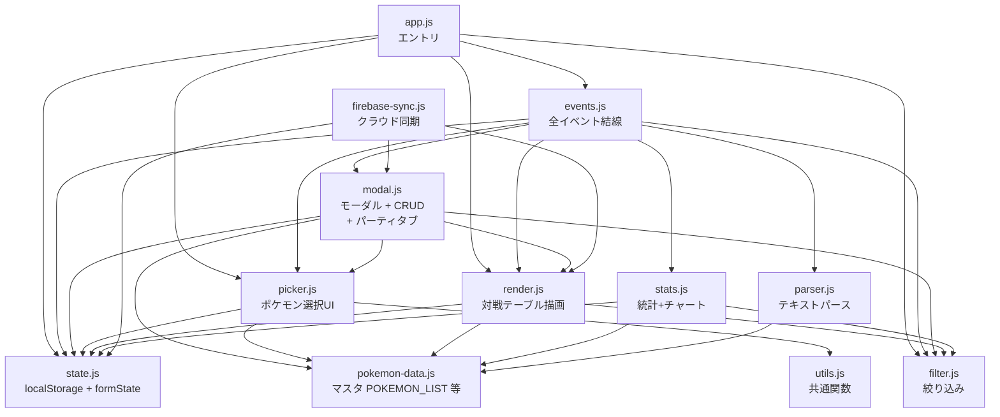
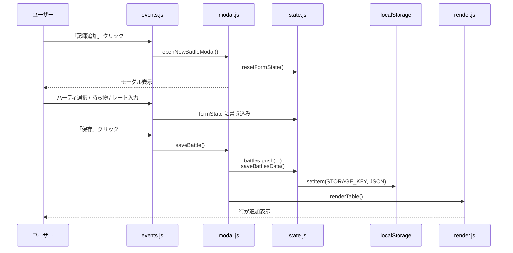
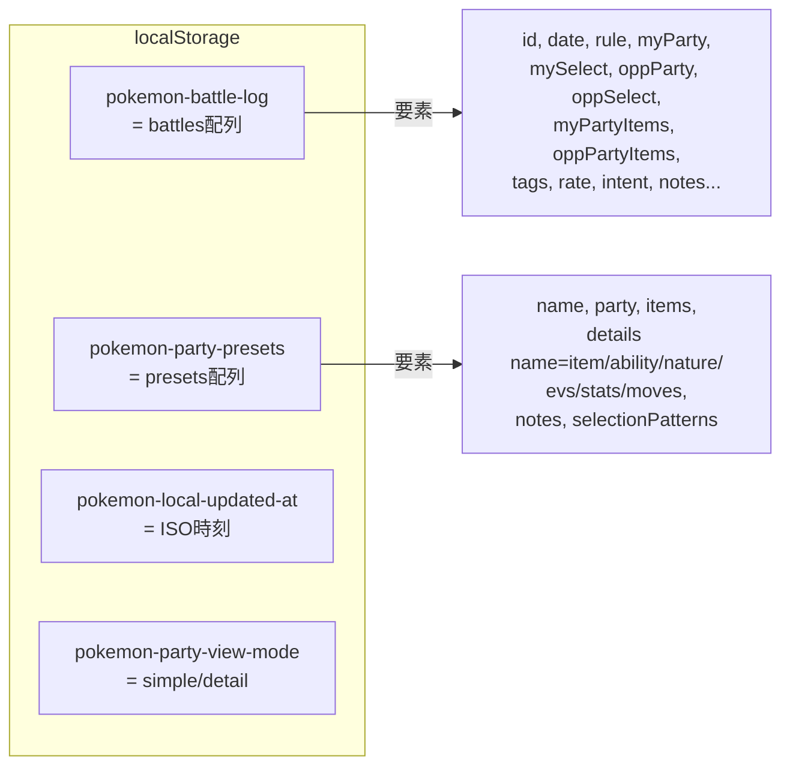
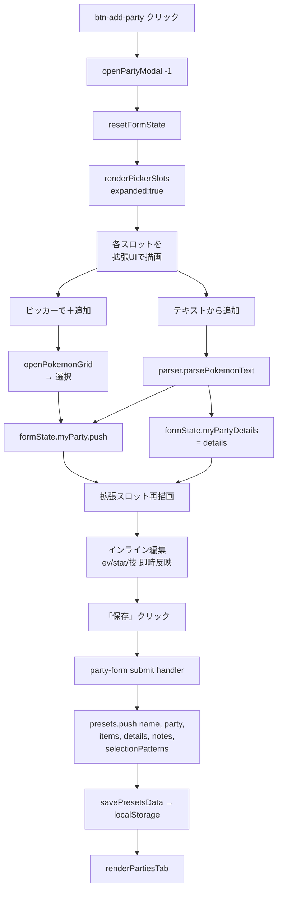

# pokemon-battle-log — コード解説

> 最終更新: 2026-05-10

---

## 1. アナロジー

このアプリは「**ポケモン版・対局棋譜ノート**」。将棋プレイヤーが対局後に手を書き残すように、対戦結果（自分/相手のパーティ・選出・レート・メモ）を1試合ずつ「行」として積んでいく。

別の例えなら「**トレーディングカードのバインダー + Excelシート + 戦績手帳**」のハイブリッド。
- バインダー: パーティタブ（チーム構成のコレクション）
- Excelシート: 対戦記録タブ（行×列）
- 手帳: 選出意図・勝因敗因・改善点メモ

データは全部 `localStorage` に閉じ込めるローカルファースト。Firebase はオプションのクラウド同期で「個人用バックアップ」程度の役割。PWA なのでスマホで「ホーム画面に追加」するとネイティブアプリっぽく動く。

---

## 2. 全体構造

### モジュール依存グラフ



ポイント:
- **`state.js`** が中心。`localStorage` の読み書きと、フォーム編集中の一時状態 `formState` を持つ
- **`pokemon-data.js`** はほぼ静的なマスタデータ（約990行）
- **`events.js`** が全体の配線盤。DOM イベントを各モジュールにルーティング
- 循環依存回避: `state.js` は `showToast` を `setShowToastFn` で注入してもらう

### データフロー（記録追加 1ターンの動き）



### ストレージ構造



---

## 3. コードウォークスルー

### 起動シーケンス（`app.js`）

1. `setShowToastFn(showToast)` — 循環依存回避のため state に toast 関数を注入
2. `initPicker()` — ポケモン選択モーダルのイベント結線
3. `initEvents()` — その他全イベント結線
4. 既存対戦のルール値を filter dropdown に補完登録
5. URL ハッシュからフィルタ復元 → `renderTable()`
6. Service Worker 登録（PWA 化）

### パーティ登録（モーダル → 保存）の流れ



### テキストパースの中身（`parser.js`）

入力例:
```
リザードン @ リザードナイトX
特性: もうか
能力補正: いじっぱり
163(10)-149(32)-98-116-105-144(24)
フレアドライブ / げきりん / ニトロチャージ / ドラゴンクロー
```

処理:
1. 改行分割 → 全角スペース・全角コロン正規化 → 各行 trim
2. 1行目: `名前 [@ 持ち物]` を `@` で split
3. 2行目以降を 5パターンの正規表現で順に試す:
   - `特性|とくせい|Ability` → `ability`
   - `性格|能力補正|Nature` → `nature`
   - `持ち物|もちもの|Item` → `item`
   - `技|わざ|Moves` → `moves`
   - `数値-数値-...` 6個 → `stats`/`evs` に分解
   - 「/」入りのフォールバック → `moves`
4. メガ進化形は `MEGA_BASE` でベース名へ正規化
5. `POKEMON_BY_NAME` で実在チェック

返り値: `{ name, details: {...} }` または `{ error: '...' }`

### Firebase 同期（`firebase-sync.js`）

「クラウドの SSOT」ではなく「最新タイムスタンプ持ちが勝つ」式。
1. ログイン後、Firestore の `users/{uid}` から `battles`/`presets`/`updatedAt` を取得
2. ローカル `pokemon-local-updated-at` と比較
3. ローカル新しければ push、リモート新しければ pull、両方更新で「競合モーダル」

---

## 4. 注意点・落とし穴

### 🔴 メガ進化の正規化
ストレージ上は「リザードン」(ベース名)で持ち、`items[ベース名] = "メガストーン"` で表現するのが原則。
- パーサ経由の `details.item` は「リザードナイトX」と原文を保持(X/Y 区別が必要なため)
- `state.normalizeMegaInBattle/Preset` は古いデータ(メガ形が `myParty` に残っているもの)を読み込み時に変換
- うっかり `formState.myParty.push("メガリザードンX")` すると統計集計でベース名と二重カウントされる。**必ずベース名でPushする**

### 🟡 `formState` はミュータブル参照
`state.formState` はモジュールスコープのオブジェクト。`{...formState}` でコピーせず使い回す箇所が多い。
- `closePartyModal` → `resetFormState()` を呼ばないと前回の details が次セッションに混ざる
- 拡張スロット編集中の input は `det = ensureDetail(name)` で参照取得後、その `det` を直接 mutate

### 🟡 localStorage 容量
1試合 1〜2KB として 5MB 制限なら 2,500〜5,000試合相当。長期使用で限界が来る可能性。`saveBattlesData` は `try/catch` で QuotaExceeded をトーストするのみ。

### 🟢 循環依存回避
- `state.js` ←→ `utils.js`(`showToast`): 関数注入で回避
- `picker.js` ←→ `modal.js`: `setPartyModalRefs` / `setOnPartyEditMyPartyChange` で参照を後注入

### 🟢 イベント二重バインド
`events.js:initEvents()` は1度だけ呼ぶ前提。HMR や複数回呼びはリスナ重複の温床。

---

## 5. 改善提案

### 品質

| 重要度 | 項目 | 内容 |
|---|---|---|
| 🔴 | EV検証なし | `parser.js` で `evs` 値の上限チェック(合計510 / 個別252)が無い。誤入力検出のため警告だけでも出すべき |
| 🔴 | 持ち物フリーテキスト | 拡張スロットの持ち物 input が完全フリーテキスト。typo した持ち物は統計に出ない別カウント扱いになる。`ITEM_LIST` に無い値を入力時に「新規追加？」確認が欲しい |
| 🟡 | テスト不在 | パーサは特に regex の挙動が壊れやすい。Vitest 等で parser/normalizeMega の単体テストを書きたい |
| 🟡 | 同期競合の merge 不在 | Firebase 競合時「強制アップロード」が選べる＝相手側の編集が消える。id ベースで union する merge ロジックが無い |
| 🟢 | 型安全性 | プレーン JS。preset/battle のスキーマが暗黙。JSDoc か TS 化で IDE 補完が効く |

### パフォーマンス

| 重要度 | 項目 | 内容 |
|---|---|---|
| 🟡 | 全件再描画 | `renderTable()` / `renderPartiesTab()` は毎回 innerHTML 全置換。1000試合超でモバイルが重くなる。仮想スクロールか差分更新検討 |
| 🟡 | `stats.js` 1078行 | 統計タブ表示時の集計が O(N×M)。`statsDirty` フラグで再計算抑制してるが、初回 N=1000 で重い予感 |
| 🟢 | sprite URL hot-link | `pokemon-data.js` の sprite URL は外部 CDN ホットリンク。CDN 障害でアイコン全消失。SW でキャッシュ戦略を強化したい |

### 可読性

| 重要度 | 項目 | 内容 |
|---|---|---|
| 🟡 | `modal.js` 687行 | モーダル＋ CRUD ＋パーティタブ＋プリセット＋ side panel が同居。最低でも `party-modal.js` を切り出したい |
| 🟡 | `events.js` 454行の手作り配線 | DOM ID 文字列が散在。`events-records.js`/`events-party.js`/`events-sync.js` 等に分割すると保守しやすい |
| 🟢 | マジックナンバー | `8`(パーティ最大)、`6`(相手パーティ最大)、`4`(選出)、`3`(選出パターン行)、`252` などが各所に直書き。`constants.js` に集約 |
| 🟢 | コメント方針 | 日本語コメントは充実だが、JSDoc 形式で関数シグネチャを書けば IDE で補完される |

---

## 6. ロードマップ

### Phase 1（すぐやる・低コスト高効果）

| 項目 | なぜやるか | 工数 |
|---|---|---|
| **持ち物バリデーション + 「新規追加？」プロンプト** | 統計の正確性が一気に上がる。typo 由来の集計分散を防ぐ | S |
| **EV合計バー表示** | 編集中に合計値が見えると入力ミスが激減(510超や4の倍数違反を即視認) | S |
| **パース時の警告**(合計超過/個別252超) | 入力品質ガードレール | S |
| **「同じパーティで記録」ボタン** | 既存「この構成で記録」の動線を強化、連戦時の入力時短 | S |
| **テキストエクスポート**(パーティ→Showdown形式) | 他ツール連携。コピペで `@smogon/calc` に流せる | S |

### Phase 2（次にやる・中工数）

| 項目 | なぜやるか | 工数 |
|---|---|---|
| **`modal.js` の分割** | パーティ関連・対戦関連・サイドパネルを別ファイル化。今後の機能追加に備える | M |
| **対戦記録の「テンプレ複製」機能** | 直前の試合と相手だけ違うケースをワンクリックで | M |
| **タグの色分け** | 視覚的にカテゴリが分かる。フィルタ UX 向上 | M |
| **個別ポケモンの統計ドリルダウン**(「このポケモンを使った試合一覧」) | ペア/トリオ統計から1体ドリルダウンができない | M |
| **対戦予測**(過去戦績に基づく「この相手構成への勝率」) | side-panel が既に「過去戦績」を出してるので拡張余地大 | M |
| **CSVエクスポートに details 列追加** | 現状 CSV は持ち物だけ。技/性格/努力値も列追加で外部分析可能に | S-M |

### Phase 3（将来・大改修）

| 項目 | なぜやるか | 工数 |
|---|---|---|
| **TS 化 + Vite 化** | スキーマが暗黙で壊しやすい。型 + ビルド最適化で生産性UP | L |
| **仮想スクロール**(対戦テーブル) | 数千試合で moving window 描画 | M-L |
| **多人数共有モード**(チーム内パーティ共有) | Firestore のドキュメント分離で `team/{teamId}` スコープ追加 | L |
| **対戦動画/スクショ添付** | Firebase Storage 連携。試合の質感を残せる | L |
| **AI レビュー機能**(メモ＋構成からの改善案) | LLM API 連携。ターゲットが「対戦上達」ならコア機能に化ける | L |
| **PWA フルオフライン同期キュー** | 機内モードでも記録追加→オンライン復帰で自動 push | M-L |

---

## まとめ

**強み**: ローカルファーストで動作軽快、PWA 対応、Firebase 同期もオプション、データ構造が比較的シンプルで拡張しやすい。

**弱み**: 中央集権ファイル(`modal.js`/`events.js`/`stats.js`)が肥大化中。テスト不在で regex / 統計ロジックの破壊耐性が低い。

**次の一手**: Phase 1 の「持ち物バリデーション」と「EV合計バー」が低工数で UX 改善効果が大きい。同時にパーサのテストを書き始めると今後の保守が楽になる。
