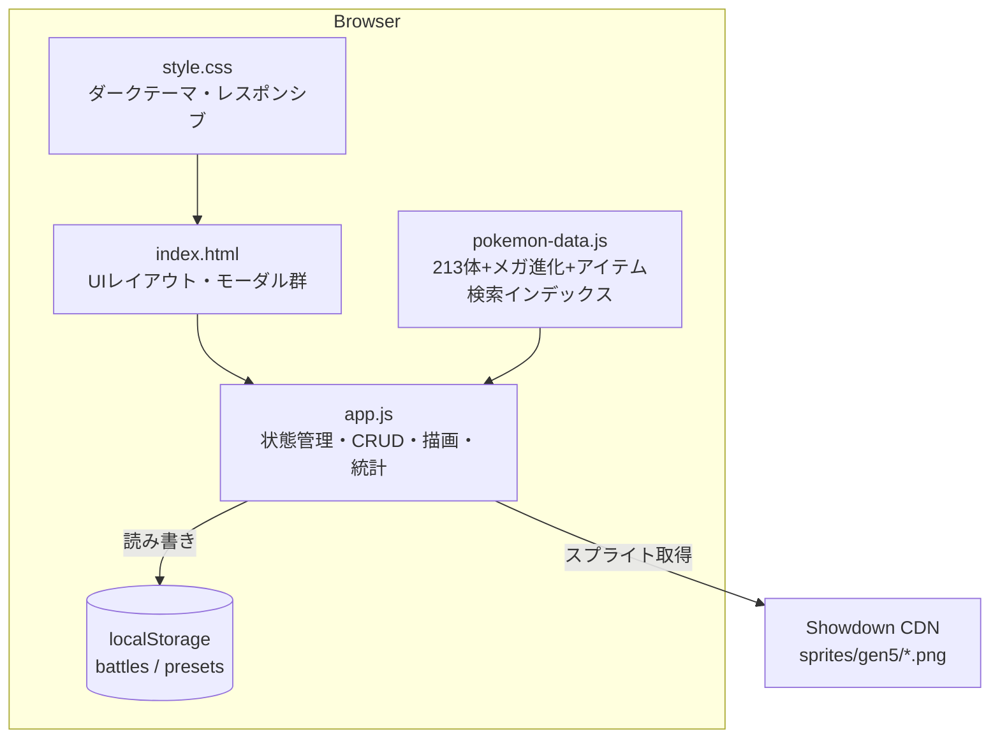
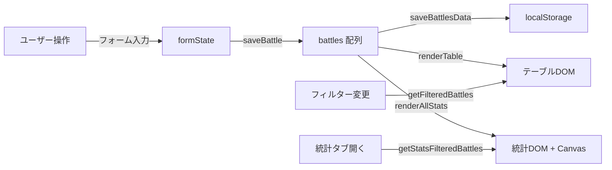
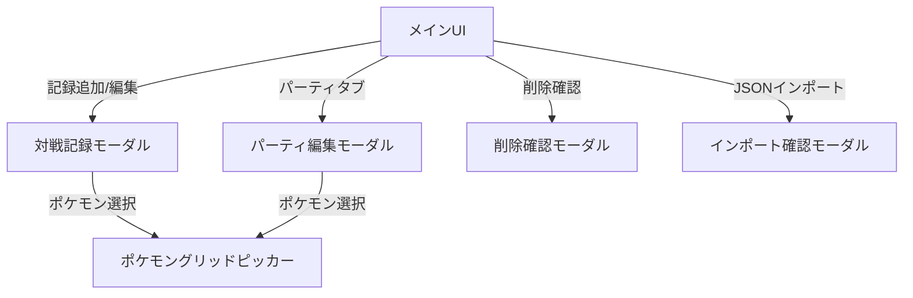
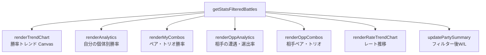

# pokemon-battle-log コード解説

> 最終更新: 2026-04-14

---

## 1. アナロジー: 「トレーナーの手帳 + 分析官」

このアプリは、**ポケモントレーナーの対戦記録手帳**のデジタル版。

日常生活で例えると、**野球のスコアブック + 打率計算係**のようなもの。

- **スコアブック** = 対戦記録テーブル（日付、パーティ、結果、メモを1行ずつ記録）
- **打率計算係** = 統計タブ（ポケモンごとの勝率、ペア/トリオの勝率、トレンドグラフを自動計算）
- **常連チームの名簿** = パーティプリセット（よく使う6体の組み合わせを名前付きで保存）
- **引き出し** = localStorage（ブラウザが手帳を預かってくれるので、サーバー不要）

もう少し技術的に言うと、**スプレッドシートをReactなしのバニラJSで再実装したSPA**。フレームワーク依存ゼロで、`index.html`を開くだけで動く。

---

## 2. アーキテクチャ図

### 全体構造



### データフロー



### モーダル階層



### 統計計算の構造



---

## 3. コードウォークスルー

### ファイル構成

| ファイル | 行数 | 役割 |
|---------|------|------|
| `index.html` | ~393 | UIの骨格。5つのモーダル、3つのタブ、テーブル、フィルター、FAB |
| `pokemon-data.js` | ~989 | 213体のポケモンデータ、メガ進化マッピング、ローマ字変換、レギュレーション別許可リスト |
| `app.js` | ~1884 | アプリ本体。状態管理、CRUD、描画、統計計算、イベントハンドラ |
| `style.css` | ~1200 | ダークテーマUI、レスポンシブ、アニメーション |

### pokemon-data.js の処理フロー

1. **`POKEMON_LIST`** — 213体 + メガ進化のオブジェクト配列 `{name, slug, dex}`
2. **`MEGA_MAP` / `MEGA_BASE`** — 基本形↔メガ進化の双方向マッピングを構築
3. **`POKEMON_DB`** — 重複排除 + 日本語あいうえお順ソート
4. **`POKEMON_BY_NAME`** — 名前→オブジェクトのO(1)ルックアップ辞書
5. **`toHiragana()` / `toRomaji()`** — カタカナ名を検索用にひらがな・ローマ字に変換
6. **各ポケモンに `searchHira` / `searchRomaji`** をプリコンピュート（検索時にリアルタイム変換しない）
7. **`getSpriteUrl()`** — Pokemon Showdown CDN からスプライトURLを生成
8. **`ITEM_LIST`** — 持ち物リスト（グループカテゴリ + 個別アイテム）
9. **`REGULATION_POKEMON` / `REGULATION_POKEMON_SET`** — レギュレーション別許可ポケモンをSetで高速判定

### app.js のレイヤー構造

#### 状態管理（L1-37）

```
battles[]          — 全対戦記録（localStorage から復元）
formState{}        — 現在のモーダルフォームの一時状態
  .myParty[]       — 自分のパーティ（最大6体）
  .mySelect[]      — 自分の選出（最大4体）
  .oppParty[]      — 相手のパーティ
  .oppSelect[]     — 相手の選出
  .tags[]          — タグ配列
  .myPartyItems{}  — ポケモン名→持ち物のマップ
  .oppPartyItems{} — 同上（相手側）
```

`formState` はモーダルが開いている間だけの一時バッファ。保存時に `battles[]` に書き出す。

#### ポケモンピッカー（L182-499）

ポケモン選択UIは2段階のインタラクション:

1. **スロット表示** (`renderPickerSlots`) — 選択済みのポケモンをドラッグ＆ドロップで並べ替え可能なスロットで表示。各スロットに持ち物セレクトと削除ボタン付き
2. **グリッドモーダル** (`openPokemonGrid` → `renderPokemonGrid`) — ポケモンを検索して追加。レギュレーション絞り込み、使用頻度順ソート、4種の検索（カタカナ/ひらがな/ローマ字/英語slug）

**選出UI** (`renderSelectFromParty`) は、パーティから選出する3-4体をクリックでトグル。メガ進化があるポケモンには「M」バッジが表示され、クリックでフォーム切り替え。

#### テーブル描画（L567-639）

`renderTable()` が呼ばれるたびに:
1. `getFilteredBattles()` でルール/結果/タグ/期間フィルター適用
2. 日付+IDでソート（同日はID順で安定ソート）
3. テーブルHTMLを `innerHTML` で全置換
4. ヘッダーの W/L/勝率を `updateStats()` で更新
5. `statsDirty = true` を立て、統計タブが表示中なら即再描画

#### 統計計算（L645-1213）

- **勝率トレンド** (`renderTrendChart`) — Canvas 2D APIで累積勝率を折れ線グラフ描画。グラデーション面積塗り、50%基準線、各ドットの勝敗色分け
- **レート推移** (`renderRateTrendChart`) — レート記録の折れ線グラフ。Y軸は記録範囲で自動スケール、ドットは勝敗で色分け
- **個体統計** (`renderAnalytics`) — 選出ポケモンごとのW/L棒グラフ
- **コンボ統計** (`renderMyComboGrid`, `renderOppComboGrid`) — `getCombinations()` で全C(n,k)を列挙し、先頭を固定したキーで集計（リード保存型）
- **相手統計** (`renderOppAnalytics`) — 遭遇数 vs 選出数で相手のパーティ傾向を可視化

#### CRUD + エクスポート（L1257-1413）

- **保存**: `saveBattle()` — IDがあれば更新、なければ新規追加 → `saveBattlesData()` で localStorage書き込み
- **CSV**: UTF-8 BOM付き、`/` 区切りでパーティを結合
- **JSON**: 生配列の `JSON.stringify` → Blob → ダウンロード
- **インポート**: 上書き or 既存に追加を選択可能

#### イベントハンドラ（L1631-1884）

- テーブルクリックはイベント委任 (`$tableBody.addEventListener`) で `data-action` 属性を使って分岐
- `Ctrl+N` で新規追加、`Esc` で最前面モーダルを順に閉じる
- タブ切り替えは遅延描画（統計タブは `statsDirty` フラグで必要時のみ再計算）
- `window.resize` でトレンドチャートを再描画

---

## 4. 注意点・よくある誤解

### ポケモンピッカーの2層構造

フォームの「自分のパーティ」と「選出」は独立したUIだが、**データは連動している**。パーティを変更すると `updateDependentSelections()` が呼ばれ、選出から外れたポケモンが自動削除される。

### メガ進化の扱い

- `MEGA_MAP`: 基本形 → メガ形（配列。リザードンはX/Yの2つ）
- `MEGA_BASE`: メガ形 → 基本形（逆引き）
- **パーティ編成時のポケモングリッド（`renderPokemonGrid`）からはメガ形を除外**（選べるのは基本形のみ）
- 選出UI（`renderSelectFromParty`）では基本形にMバッジを出し、クリックでメガ形へトグル（選出配列にのみメガ名が入る）
- `loadBattles` / `loadPresets` / インポート時に `normalizeMegaIn*` で過去データのメガ名を基本形へ正規化
- 統計計算では `MEGA_BASE` で正規化してからカウント

### localStorage の容量制限

`saveBattlesData()` で `try/catch` しており、容量超過時はトーストでエラー通知。ただし、**容量超過の予防的チェックはない**。

### 検索のマルチ言語対応

ポケモン検索は4系統を並列チェック:
1. `name` (カタカナ) — `includes`
2. `slug` (英語) — `includes`
3. `searchHira` (ひらがな変換済み) — `includes`
4. `searchRomaji` (ローマ字変換済み) — `includes`

ローマ字変換は `toRomaji()` でヘボン式。促音（ッ→子音二重化）、長音（ー→母音繰り返し）、拗音（キャ→kya）を正しく処理。

### レギュレーション対応

`REGULATION_POKEMON` に許可リストをSetで持ち、ルール選択時にポケモングリッドを自動フィルター。旧ルールで記録したデータは `ensureRuleOption()` で動的にドロップダウンに追加されるため、編集時にも失われない。

---

## 5. 改善提案

### 品質

| # | 指摘 | 重要度 | 詳細 |
|---|------|--------|------|
| 1 | innerHTML によるXSSリスク | 🟡 Medium | `escapeHtml()` で対策されているが、`renderPokeIconsHtml` 等で `slug` が直接URLに埋め込まれている。slug はアプリ内定数のため実害はないが、JSONインポートで外部データを受け入れるため、インポート時にslugのバリデーションを入れるとより安全 |
| 2 | インポートデータのバリデーション不足 | 🟡 Medium | `handleImportFile()` は配列かどうかしかチェックしていない。必須フィールド (`id`, `date`, `result`) の存在チェックがなく、不正データが `battles[]` に混入する可能性がある |
| 3 | `formState` がグローバルミュータブル | 🟢 Low | モーダルが1つしか同時に開かないため現状は問題ないが、パーティ編集モーダルと対戦記録モーダルが `formState.myParty` を共有しているため、両方が開いた状態でのエッジケースに注意 |
| 4 | 勝率トレンドの引き分け扱い | 🟢 Low | `total` は勝ち+負けのみカウント。引き分けは無視されるが、引き分けが多い場合にトレンドが実態と乖離する可能性がある |

### パフォーマンス

| # | 指摘 | 重要度 | 詳細 |
|---|------|--------|------|
| 1 | テーブル全置換 `innerHTML` | 🟡 Medium | 毎回のフィルター変更・ソートでDOM全体を再構築。100件程度なら問題ないが、500件超で描画が重くなる可能性。仮想スクロールまたは差分更新で改善可能 |
| 2 | `getPokemonUsageCounts()` が毎回全走査 | 🟢 Low | ポケモングリッドを開くたびに全battles をスキャンして使用回数を計算。キャッシュすれば高速化できる |
| 3 | 統計の全再計算 | 🟢 Low | `renderAllStats()` がタブ切替のたびに7つの統計を全再計算。変更がなければスキップする仕組み（`statsDirty`）は既にあるが、個別の統計単位で差分更新できるとさらに効率的 |

### 可読性

| # | 指摘 | 重要度 | 詳細 |
|---|------|--------|------|
| 1 | app.js が1884行の単一ファイル | 🟡 Medium | 状態管理、CRUD、描画、統計、イベントハンドラが全て1ファイル。責務別にモジュール分割すると保守性が向上 |
| 2 | マジックナンバー `4` (選出上限) | 🟢 Low | `data-max="4"` とハードコードされている箇所が複数。バリデーション (`formState.mySelect.length < 3`) と不整合の可能性 |
| 3 | コンボキーのリード保存ロジック | 🟢 Low | `comboKey()` は先頭要素を固定して残りをソートする「リード保存」だが、この意図がコメント以外で明示されていない |

---

## 6. ロードマップ

### Phase 1（すぐやる）— 低コスト高効果

| # | やること | 理由（期待効果） | 工数 |
|---|---------|-----------------|------|
| 1 | JSONインポートのフィールドバリデーション | 不正データ混入を防止。必須フィールドチェック + 型検証 | S |
| 2 | ページネーション or 仮想スクロール | 記録が増えた時のテーブル描画パフォーマンスを改善 | S |
| 3 | 対戦記録の一括削除・一括エクスポート | 選択した記録だけを操作したいユースケース | S |
| 4 | フィルター状態のURL反映 | ブックマーク可能なフィルター状態。`location.hash` で十分 | S |

### Phase 2（次にやる）— 中工数で高価値

| # | やること | 理由（期待効果） | 工数 |
|---|---------|-----------------|------|
| 1 | app.js のモジュール分割 | 保守性向上。`state.js` / `render.js` / `stats.js` / `events.js` に分離 | M |
| 2 | 対戦メモのリッチ化（マークダウン or チェックリスト） | 振り返り機能の強化。「次回の課題」を管理しやすくする | M |
| 3 | ポケモンごとの対面勝率マトリクス | 「自分のXが相手のYに何勝何敗か」を可視化。選出判断の参考に | M |
| 4 | 複数レギュレーション対応 | 新シーズン追加時に `REGULATION_POKEMON` を拡張するだけで済むよう、UI側もレギュレーション動的生成に | M |

### Phase 3（将来）— 大きな設計変更

| # | やること | 理由（期待効果） | 工数 |
|---|---------|-----------------|------|
| 1 | IndexedDB 移行 | localStorage の5MB制限を回避。画像キャッシュや大量データに対応 | L |
| 2 | PWA 化（Service Worker + manifest） | オフライン完全対応 + ホーム画面追加。モバイルでのUX向上 | L |
| 3 | クラウド同期（Firebase / Supabase） | 端末間のデータ共有。複数デバイスで記録を付けたいユーザー向け | L |
| 4 | 対戦動画リンク + タイムスタンプ付きメモ | 動画レビューとの連携。対戦の特定ターンにメモを紐付け | L |
